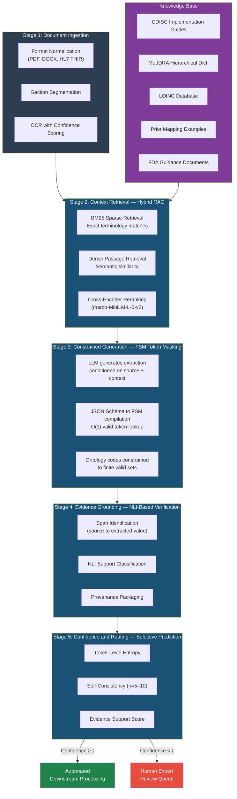
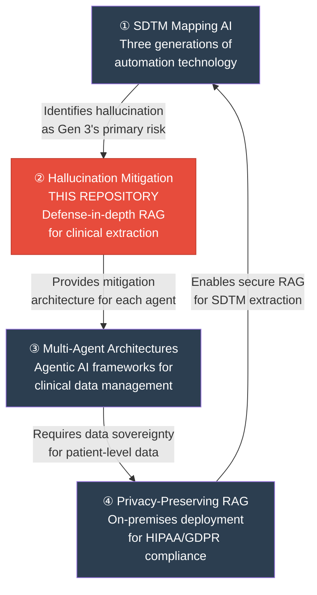

<p align="center">
  <strong>Mitigating Large Language Model Hallucinations for Clinical Data Extraction</strong><br/>
  <em>A Retrieval-Augmented Framework With Structured Output Enforcement</em>
</p>

<p align="center">
  
  
  
  
  
</p>

<p align="center">
  <a href="#the-problem">The Problem</a> •
  <a href="#regulatory-landscape">Regulatory Landscape</a> •
  <a href="#defense-in-depth-architecture">Architecture</a> •
  <a href="#failure-mode-taxonomy">Failure Modes</a> •
  <a href="#evaluation-framework">Evaluation</a> •
  <a href="#research-program-context">Research Program</a> •
  <a href="#citation">Citation</a>
</p>

-----

## The Problem

Large Language Models generate fluent, confident, and **factually incorrect** outputs at rates that are unacceptable for regulated clinical data environments. The clinical stakes are severe: a fabricated drug name, incorrect dosage, hallucinated laboratory value, erroneous MedDRA preferred term, or invalid LOINC code can compromise FDA submissions, trigger cascading errors through downstream safety analyses, and contribute to patient harm.

The critical empirical insight motivating this work: **hallucination is not a fixed property of a model**. Published evaluations show rates varying from low single digits under optimized conditions to over 80% under adversarial prompting — demonstrating that **the engineering challenge lies in system architecture, not model selection alone**.

This paper synthesizes established, peer-reviewed mitigation techniques into a **five-stage defense-in-depth reference architecture** for clinical data extraction, with focus on three high-stakes tasks:

|Task                        |Controlled Terminology       |Clinical Risk of Hallucination                          |
|----------------------------|-----------------------------|--------------------------------------------------------|
|**CDISC SDTM Mapping**      |SDTM domains, CDISC CT       |Incorrect dataset structure in FDA submissions          |
|**Adverse Event Coding**    |MedDRA (SOC → PT → LLT)      |Masked safety signals; misclassified serious AEs        |
|**Laboratory Normalization**|LOINC codes, reference ranges|Incorrect lab shift analyses; distorted efficacy signals|

-----

## Paper Statistics

|Attribute             |Value                                                                         |
|----------------------|------------------------------------------------------------------------------|
|**Type**              |Position paper / Conceptual reference architecture                            |
|**References**        |22 (peer-reviewed ML, NLG, clinical NLP, and regulatory sources)              |
|**Novel Claims**      |None — contribution is structured integration of existing published techniques|
|**Empirical Results** |None — framework has not been implemented or validated                        |
|**Ontologies Covered**|MedDRA, LOINC, SNOMED CT, WHO Drug Dictionary Enhanced, CDISC CT              |

-----

## Intended Audience

- **Clinical data standards architects** designing AI-assisted extraction pipelines for SDTM, ADaM, or CDASH
- **Pharmaceutical AI/ML engineers** building LLM systems that must pass 21 CFR Part 11 audit
- **Regulatory affairs professionals** evaluating risk profiles of AI-generated clinical data
- **Medical coding teams** assessing AI-augmented MedDRA and LOINC workflows
- **Legal and compliance counsel** reviewing hallucination risk in regulated AI deployments

-----

## Regulatory Landscape

|Instrument                     |Specific Provision                                                 |Architectural Implication                                                          |
|-------------------------------|-------------------------------------------------------------------|-----------------------------------------------------------------------------------|
|**CDISC SDTM / SDTMIG v3.4**   |Target schema (50+ domains, 3 observation classes)                 |Output schemas for constrained decoding FSM compilation                            |
|**MedDRA**                     |5-level hierarchy (SOC → HLGT → HLT → PT → LLT)                    |Finite token sets for ontology-constrained generation                              |
|**LOINC**                      |Multi-axial structure (component, property, timing, system, method)|Tool-use validation functions for code lookup                                      |
|**FDA GMLP**                   |10 principles (Oct 2021, updated Jan 2025 via IMDRF)               |Provenance tracking; human–AI team performance; dataset drift monitoring           |
|**FDA Transparency Principles**|2024 guidance                                                      |Every extraction must explain *why* it is correct and *when* it might be wrong     |
|**21 CFR Part 11**             |§164.312 — Audit trails; electronic signatures                     |Complete provenance chain from source text → AI prediction → final validated output|
|**HIPAA**                      |Privacy Rule — minimum necessary standard                          |De-identification requirements for prior mapping examples in RAG index             |
|**GDPR**                       |Article 9 — special category (health data)                         |Consent/legal basis for processing; data governance for retrieval indices          |
|**EU AI Act**                  |Regulation 2024/1689, Annex III                                    |Potential high-risk classification; conformity assessment                          |

-----

## Defense-in-Depth Architecture

Each stage addresses a **distinct hallucination mechanism** documented in the peer-reviewed literature. No single stage is relied upon alone.



### What Each Stage Eliminates

|Stage                   |Hallucination Type Addressed                                                      |Mechanism                                                         |
|------------------------|----------------------------------------------------------------------------------|------------------------------------------------------------------|
|**Stage 2** (RAG)       |Extrinsic hallucination — fabricated claims unsupported by evidence               |Grounds generation in retrieved, verifiable source material       |
|**Stage 3** (FSM)       |Ontology boundary violations — terms resembling but not in controlled terminology |**Eliminates entirely** for well-defined schemas via token masking|
|**Stage 4** (NLI)       |Intrinsic hallucination — claims contradicting source data                        |Entailment check verifies each extraction against cited span      |
|**Stage 5** (Abstention)|Fabrication under pressure — plausible values invented when source is insufficient|Routes uncertain extractions to human review instead of guessing  |

### NLI Support Classification

The evidence grounding module classifies each extraction using categories adapted from standard Natural Language Inference:

|Classification       |NLI Analogue |Action                                                       |
|---------------------|-------------|-------------------------------------------------------------|
|`FULLY_SUPPORTED`    |Entailment   |Extracted value explicitly stated in source                  |
|`PARTIALLY_SUPPORTED`|Neutral      |Inferable but requires interpretation                        |
|`UNSUPPORTED`        |—            |No source evidence found → **routed to human review**        |
|`CONTRADICTED`       |Contradiction|Source conflicts with extraction → **routed to human review**|

-----

## Failure Mode Taxonomy

|Failure Mode                   |Example                                                                   |Mitigation                                                                          |
|-------------------------------|--------------------------------------------------------------------------|------------------------------------------------------------------------------------|
|**Entity Conflation**          |Mapping ALT to the LOINC code for AST (both liver enzymes)                |Ontology-aware validation; self-consistency detects vacillation                     |
|**Temporal Reasoning Error**   |Lab value from screening visit attributed to treatment visit              |Section-aware chunking; temporal metadata per chunk                                 |
|**Ontology Boundary Violation**|Generating a MedDRA term that *looks right* but isn’t in the hierarchy    |**Constrained decoding eliminates entirely** for enumerable ontologies              |
|**Fabrication Under Pressure** |Hallucinating a plausible dosage when source document is missing the field|Explicit abstention instructions; confidence calibration on low-evidence extractions|

-----

## Evaluation Framework

### Four Required Baselines

|Baseline                                                 |What It Isolates                               |
|---------------------------------------------------------|-----------------------------------------------|
|**Standalone LLM** (zero-shot / few-shot)                |Contribution of mitigation layers vs. raw model|
|**LLM + RAG only** (no constrained decoding or grounding)|Incremental value of structural constraints    |
|**Rule-based autocoding** (MedDRA, LOINC, SDTM)          |Traditional non-ML reference point             |
|**Human expert extraction** (independent data managers)  |Performance ceiling + inter-annotator agreement|

### Metrics

|Component            |Primary Metrics                                                                                                      |
|---------------------|---------------------------------------------------------------------------------------------------------------------|
|Retrieval Quality    |Recall@10 ≥ 0.85 target; nDCG@k; P@5                                                                                 |
|Generation Factuality|FActScore (atomic fact decomposition); Exact Match; Token-level F1                                                   |
|Terminology Mapping  |Hit@k; **F0.5** (precision-weighted for SDTM compliance); **F2** (recall-weighted for safety signal detection); AUROC|

### Human Evaluation Rubric

|Dimension                 |Scale |Definition                                                      |
|--------------------------|------|----------------------------------------------------------------|
|Factual Correctness       |1–5   |Is the extracted value correct relative to the source?          |
|Ontological Validity      |Binary|Is the controlled terminology code valid and appropriate?       |
|Completeness              |1–5   |Are all extractable fields populated or flagged as undetermined?|
|Provenance Quality        |1–5   |Does the cited source span actually support the extraction?     |
|Clinical Plausibility     |1–5   |Is the extraction clinically reasonable?                        |
|Abstention Appropriateness|Binary|When the system abstained, was abstention justified?            |

Minimum **3 independent reviewers** per extraction; inter-rater reliability via **Fleiss’ kappa**; disagreements resolved by senior clinical data manager.

-----

## Scope and Limitations

This is a **position paper** synthesizing published techniques into a conceptual reference architecture. **No implementation or empirical validation is reported.** No component is claimed as a novel invention; the contribution lies in structured review, integration, and clinical-domain contextualization of existing methods. The framework assumes English-language source documents. Performance has not been validated across therapeutic areas. FSM compilation for very large ontologies (SNOMED CT: 350K+ concepts) may introduce non-trivial computational overhead. Whether the defense-in-depth layers interact additively, multiplicatively, or antagonistically is an empirical question that requires experimental validation.

-----

## Repository Structure

```
clinical-rag-hallucination/
├── README.md                                  # This file
├── LICENSE
├── CITATION.cff
└── manuscript/
    └── clinical_rag_hallucination.md           # Full manuscript
```

-----

## Research Program Context

This paper is part of a four-paper independent research program examining AI deployment in regulated clinical data environments:



|#    |Repository                                                                                             |Focus                                                                   |
|-----|-------------------------------------------------------------------------------------------------------|------------------------------------------------------------------------|
|**1**|[sdtm-mapping-ai](https://github.com/DanielMartin-Arogyasami/sdtm-mapping-ai)                          |Landscape review identifying hallucination as the critical Gen 3 risk   |
|**2**|**[clinical-rag-hallucination](https://github.com/DanielMartin-Arogyasami/clinical-rag-hallucination)**|**Solving the hallucination problem with defense-in-depth architecture**|
|**3**|[clinical-query-agent](https://github.com/DanielMartin-Arogyasami/clinical-query-agent)                |Operationalizing multi-agent orchestration with hallucination guardrails|
|**4**|[privacy-rag-onprem](https://github.com/DanielMartin-Arogyasami/privacy-rag-onprem)                    |Deploying the RAG subsystem within institutional security perimeters    |

-----

## Citation

```bibtex
@article{arogyasami2026hallucination,
  title   = {Mitigating Large Language Model Hallucinations for Clinical Data
             Extraction: A Retrieval-Augmented Framework With Structured
             Output Enforcement},
  author  = {Arogyasami, DanielMartin},
  year    = {2026},
  note    = {Preprint — position paper — not yet peer reviewed},
  url     = {https://github.com/DanielMartin-Arogyasami/clinical-rag-hallucination}
}
```

-----

## Author

**DanielMartin Arogyasami** — Enterprise Clinical AI & Data Architect

[LinkedIn](https://linkedin.com/in/danielmba)

-----

## License

This manuscript is shared for academic discussion and independent scholarly review. See <LICENSE> for terms.

-----

## Integrity Statement

Every component technology discussed in this paper is drawn from published, peer-reviewed academic literature and publicly available regulatory documents. The conceptual reference architecture represents a literature synthesis exercise, not a disclosure of any existing or planned system. No proprietary data, internal systems, confidential methodologies, trade secrets, or unpublished work products of any employer informed this work. The author declares no conflicts of interest. No funding was received.

-----

**Keywords:** `large language models` · `hallucination mitigation` · `clinical data extraction` · `retrieval-augmented generation` · `constrained decoding` · `SDTM` · `MedDRA` · `LOINC` · `FDA GMLP` · `21 CFR Part 11` · `structured outputs` · `selective prediction`
